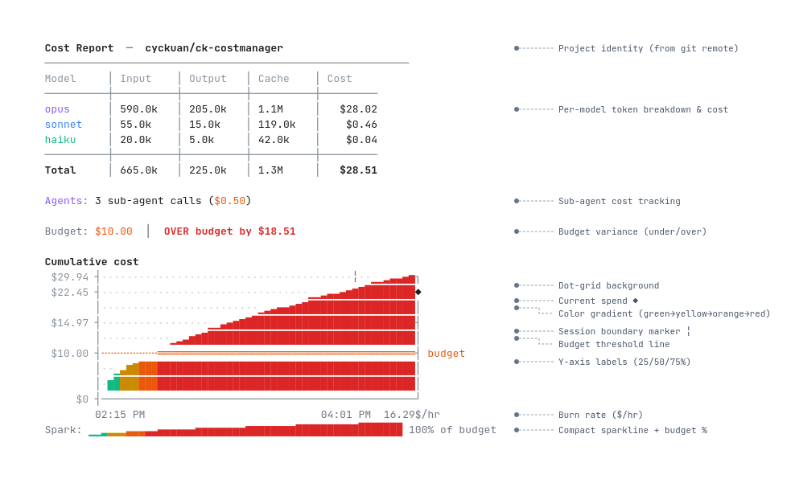

# ck-costmanager

A Claude Code plugin that tracks token usage and calculates costs per project. Tracking is on by default — no setup required.



## Why

Claude Code doesn't provide per-project cost breakdowns. If you work across multiple repositories — or bill clients for AI-assisted development — you need to know exactly what each project costs.

**Client budgets.** When a client allocates a fixed budget for AI-assisted work, you need real-time visibility into spend so you don't exceed the agreement. Set the budget with `/cost budget` and get immediate visual feedback when you're approaching the limit.

**Invoicing and billing.** The per-project cost logs (`~/.claude/cost-logs/*.jsonl`) provide a timestamped record of every API call — model used, tokens consumed, dollar cost. This data can form the basis of itemized invoices for contract work.

**Multi-project awareness.** Developers often context-switch across repositories in a single day. `/cost projects` shows a unified view of spend across all tracked projects, so you can see where your budget is going without switching directories.

**Persistent across sessions.** Cost data is stored on the filesystem, not in conversation memory. Logs survive `/clear`, session restarts, plugin reinstalls, and machine reboots. Your cost history is never lost.

## Installation

### From git repository

```bash
claude plugin add --from git@github.com:cyckuan/ck-costmanager.git
```

Or using HTTPS:

```bash
claude plugin add --from https://github.com/cyckuan/ck-costmanager.git
```

Restart Claude Code. Tracking begins automatically on the next session.

### Manual clone

1. Clone the repository:

```bash
git clone git@github.com:cyckuan/ck-costmanager.git ~/.claude/plugins/local/ck-costmanager
```

2. Restart Claude Code. The Stop hook registers automatically and begins tracking.

## Uninstallation

Remove the plugin and optionally delete stored logs:

```bash
claude plugin remove ck-costmanager
```

To also remove cost logs:

```bash
rm -rf ~/.claude/cost-logs/
```

## Commands

| Command | Description |
|---------|-------------|
| `/cost report` | Show cost summary with cumulative chart (current project) |
| `/cost projects` | Show summary of all tracked projects |
| `/cost budget <USD>` | Set session budget (default: $10) |
| `/cost off` | Pause tracking |
| `/cost on` | Resume tracking |
| `/cost reset` | Clear the log for this project |

## Report elements

### Project identity

The header shows the project name derived from the git remote URL (e.g. `cyckuan/ck-costmanager`). If no git remote exists, the directory name is used. Each project tracks costs independently.

### Per-model token breakdown

A table showing token counts and costs grouped by model tier:

- **Input** — prompt tokens sent to the model
- **Output** — completion tokens generated by the model
- **Cache** — combined cache write + cache read tokens (prompt caching reduces cost significantly)
- **Cost** — dollar cost for that tier, calculated from `config/modelcost.json` rates

Each tier is color-coded: purple for Opus, blue for Sonnet, green for Haiku.

### Sub-agent cost tracking

When Claude Code spawns sub-agents (parallel workers, code reviewers, etc.), their token usage is detected from the transcript and reported separately. Shows the total number of sub-agent calls and their combined cost.

### Budget variance

Compares total spend against your configured budget. Displays green "Under budget by $X" or bold red "OVER budget by $X". Set the budget with `/cost budget <amount>`.

### Cumulative cost chart

A terminal-width-responsive area chart showing how cost accumulated over time:

| Element | Description |
|---------|-------------|
| **Dot-grid background** | Subtle `·` characters fill empty cells, giving the chart a graph-paper texture so you can gauge scale even in sparse areas |
| **Color gradient** | The filled area transitions green → yellow → orange → red as spend approaches and exceeds the budget threshold |
| **Budget threshold line** | A dashed horizontal line (`╌`) at your budget amount; changes to solid (`═`) where spend has crossed it |
| **Y-axis labels** | Dollar values at 25%, 50%, 75%, and 100% of the chart scale, plus the budget line label |
| **Session boundary markers** | Vertical `╎` ticks appear where a gap in activity suggests a new session (gap > 3× average interval) |
| **Current spend marker** | A `◆` diamond on the right edge at the current cumulative cost level |
| **Time axis** | Start and end timestamps at the bottom of the chart |

### Burn rate

Shown as `$/hr` in the bottom-right of the chart area. Calculated as total cost divided by elapsed wall-clock time from first to last API call.

### Compact sparkline

A single-line miniature chart using block characters (`▁▂▃▄▅▆▇█`) with the same gradient coloring. Shows the budget utilization percentage. Useful as a quick visual summary.

## Theme support

The report adapts its color scheme to your current Claude Code theme (dark or light). Colors are read from `config/colors.json` and the active theme is detected from `~/.claude/settings.json`. Edit `config/colors.json` to customize.

## Multi-project support

Each project is tracked independently. `/cost report` always shows the current project; `/cost projects` shows a summary across all tracked projects:

- Current project marked with `▸`
- Cost, budget, and budget utilization percentage per project
- Grand total across all projects
- Last activity timestamp

### Project identification

Projects are identified by git remote URL (e.g. `cyckuan/ck-costmanager`). If no git remote is found (non-git directories), the full working directory path is used as the project identifier.

## How it works

A Stop hook fires after each turn and parses the session transcript to extract token usage (input, output, cache write, cache read) per API call. Usage is logged per-project, identified by git remote or working directory path.

Multiple Claude Code sessions in different repos track independently.

## Persistence

Cost logs are written to the filesystem (`~/.claude/cost-logs/`), not stored in conversation context. This means:

- **`/clear` safe** — clearing conversation history does not affect cost data
- **Restart safe** — quitting and restarting Claude Code picks up where it left off
- **Reinstall safe** — logs are outside the plugin directory and survive plugin removal/reinstall
- **Multi-session safe** — different terminal sessions writing to the same project append to the same log file

The only way to lose data is to manually delete the log files or run `/cost reset`.

## Log location

Logs are stored in `~/.claude/cost-logs/` — one `.jsonl` file per project plus a `state.json` for tracking offsets and budgets.

## Model pricing

Pricing is configured in `config/modelcost.json` (per million tokens):

| Model | Input | Output | Cache Write | Cache Read |
|-------|-------|--------|-------------|------------|
| Haiku | $0.80 | $4.00 | $1.00 | $0.08 |
| Sonnet | $3.00 | $15.00 | $3.75 | $0.30 |
| Opus | $15.00 | $75.00 | $18.75 | $1.50 |

Edit this file to update pricing when rates change.

## License

MIT
